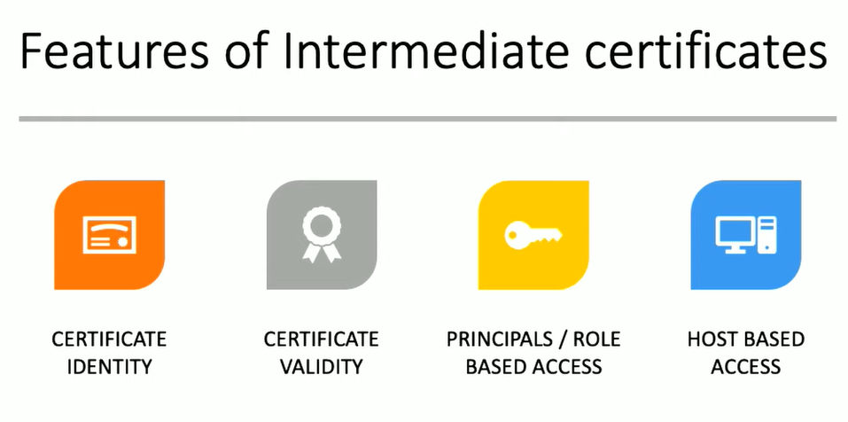
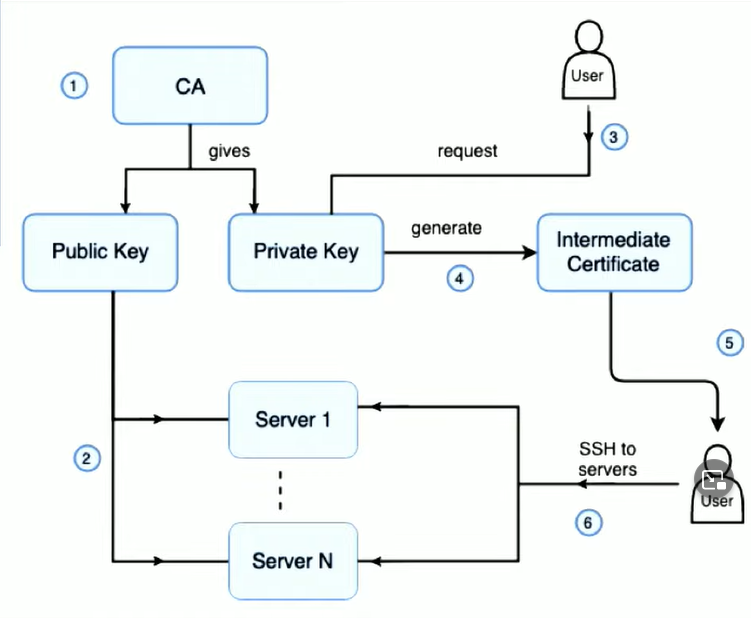
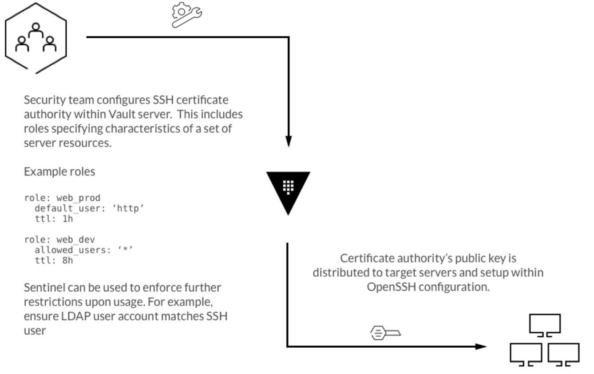
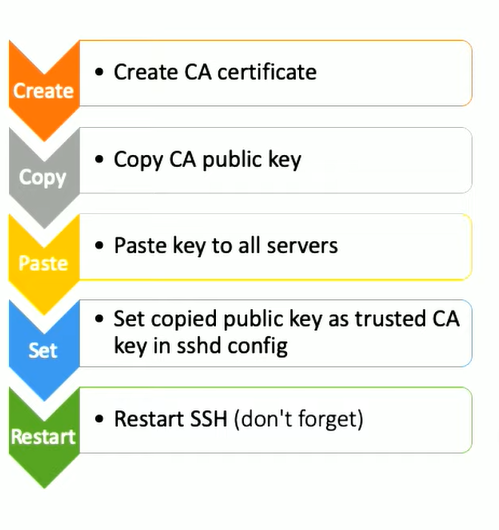

# Vault implementation

# Introduction

[parts of this section are copied parts of an article linked below - If you’re not using SSH certificates you’re doing SSH wrong written by Mike Malone]

It seems to be a common knowledge that using key-based SSH is a better practice than using password based SSH. What if I told you there is a better way than using key-based SSH?

It is probably important to say that there is nothing inherently bad in using key based authentication and that it’s an anti-pattern. It is not. However it has it’s own set of issues and if it can be done better then why not do it.


### [First the issues related to key-based ssh:](https://smallstep.com/blog/use-ssh-certificates/)

- **SSH user experience is terrible.** SSH user
  on-boarding is slow and manual. Connecting to new hosts produces
  confusing security warnings. You’re left with weird new credentials to
  manage with little guidance on how to do so.
- **Operating SSH at scale is a disaster.** Key approval & distribution is a silly waste of time. Host names
  can’t be reused. Homegrown tools scatter key material across your fleet
  that must be cleaned up later to off-board users.
- **SSH encourages bad security practices.** Rekeying is hard, so it’s not done. Users are exposed to key material
  and encouraged to reuse keys across devices. Keys are trusted
  permanently, so mistakes are fail-open.

> Most SSH deployments use _public key authentication_, which uses asymmetric (public key) cryptography with a public / private key pair generated for each user & host to authenticate.
>
> The magic of asymmetric cryptography is the special correspondence between a public and private key. You can _sign_ data with your private key and someone else can _verify_ your signature with the corresponding public key. Like a hash, it’s computationally infeasible to forge a signature. Thus, if you can verify a signature, and you know who owns the private key, you know who generated the signature. Simple authentication can be implemented by challenging someone to sign a big random number. If I open a socket to you and send a random number, and you respond with a valid signature over that number, I must be talking to you.
>
> This is an oversimplification, but it’s more or less how SSH public key authentication works. Certificate authentication works the same way, but with an important twist that we’ll get to in a moment.
>
> To SSH to a host using public key authentication the host needs to know your public key. By default, your public key must be added to `~/.ssh/authorized_keys`. Maintaining this file for every user across a fleet is operationally challenging and error prone.
>
> SSH user onboarding with public key authentication usually starts with some baroque incantation of `ssh-keygen`, hopefully pulled from a runbook, but more likely cribbed from stack overflow. Next you’ll be asked to submit your public key for _approval and distribution_. This process is typically manual and opaque. You might be asked to email an administrator or open a JIRA ticket. Then you wait. While you’re doing that, some poor operator gets interrupted and told to add your key to a manifest in some repo and trigger a deploy. Once that’s done you can SSH. Since key bindings are permanent, your SSH access will continue in perpetuity until someone reverses this process.

**Certificate authentication**

Certificate authentication eliminates key approval and distribution. Instead of scattering public keys across static files, you bind a public key to a name with a _certificate_. A certificate is just a data structure that includes a public key, name, and ancillary data like an expiration date and permissions. The data structure is signed by a _certificate authority_ (CA).






With public key authentication, when you SSH to a remote host for the
first time, you’ll be presented with a security warning like this:

```
$ ssh ubuntu@ec2-54-161-77-102.compute-1.amazonaws.com
The authenticity of host 'ec2-54-161-77-102.compute-1.amazonaws.com (54.161.77.102)' can't be established.
ECDSA key fingerprint is SHA256:2ae53QcOB0W6HO+XtPmMXk7To/MvMuhFxTj8ZD7eSsE.
Are you sure you want to continue connecting (yes/no)?

```

You’ve probably seen this before. If you’re like most people, you’ve been trained to ignore it by just typing “yes”. That’s a problem because this is a legitimate security threat. It’s also a pretty horrendous user experience. I’d wager the vast majority of SSH users don’t actually understand this warning.

What you’re _supposed_ to do is verify the key fingerprint out-of-band by asking an administrator or consulting a database or something. But no one does that. When you type “yes” the connection proceeds without authentication and the public key is permanently added to `~/.ssh/known_hosts`. This is the _trust on first use_ (TOFU) anti-pattern.

There is more to the whole topic. Here I would like to recommend reading the article that I have linked in the title (you can also click [here](https://smallstep.com/blog/use-ssh-certificates/)).

# Implementation

Now there is a number of ways you could implement SSH CA into the picture.

- `ssh-keygen` can generate root certificates and sign user & host certificates
- `[netflix/bless](https://github.com/netflix/bless)` is Netflix’s SSH CA that runs in AWS Lambda and uses IAM
- `[nsheridan/cashier](https://github.com/nsheridan/cashier)` is Intercom’s SSH CA
- `[uber/pam-ussh](https://github.com/uber/pam-ussh)` lets you use certificates to authorize `sudo` use
- `[hashicorp/vault](https://github.com/hashicorp/vault)` has an [SSH secrets engine](https://www.vaultproject.io/docs/secrets/ssh/index.html)

[Hashicorp Vault:](https://developer.hashicorp.com/vault/docs/secrets/ssh/signed-ssh-certificates)

> The signed SSH certificates is the simplest and most powerful in terms of setup complexity and in terms of being platform agnostic. By leveraging Vault's powerful CA capabilities and
> functionality built into OpenSSH, clients can SSH into target hosts using their own local SSH keys.



### Deployment and usage


Following Proof of Concept is based on official [Terraform module](https://github.com/terraform-google-modules/terraform-google-vault#vault-on-gce-terraform-module). As per documentation it is deployed according to applicable parts of the [production hardening guide](https://www.vaultproject.io/guides/operations/production.html). However to become production ready it needs some of the values changed from default values (more details in the module documentation). Again not the matter of this particular PoC as we only need operational Vault to demonstrate.




## **The steps:**

For ease of automation deploy the Vault first:

```bash
$ terraform apply -target=module.vault
#terraform output will show the IP address of Vault server
$ export VAULT_ADDR="$(terraform output vault_addr)"
$ export VAULT_CACERT="$(pwd)/ca.crt"
#wait until vault starts ~2-3 minutes
$ vault operator init \
    -recovery-shares 5 \
    -recovery-threshold 3
#write down the recovery keys and token
$ vault login
```

### [Following the Hashicorp Vault tutorial on enabling SSH engine](https://developer.hashicorp.com/vault/docs/secrets/ssh/signed-ssh-certificates#signing-key-role-configuration)

```bash
$ vault secrets enable -path=ssh-client-signer ssh
#for the sake of PoC we will generate a keypair
$ ssh-keygen -f /etc/ssh/ca
$ vault write ssh-client-signer/config/ca \
    private_key=@ca \
    public_key=ca.pub

$ vault read -field=public_key ssh-client-signer/config/ca > trusted-user-ca-keys.pem
#copy and paste the trusted-user-ca-keys.pem into the instance template script - servers-script.sh. Instance template will add the key and TrustedUserCAKeys into the sshd_config file
$ terraform apply -target=module.servers
#generate a keypair on your client machine
$ ssh-keygen -t rsa -C "user@example.com"
#ask Vault to sign your public key. This file usually ends in .pub and the contents begin with ssh-rsa ....
vault write ssh-client-signer/sign/my-role \
    public_key=@$HOME/.ssh/id_rsa.pub
#save the signed public key on your machine
vault write -field=signed_key ssh-client-signer/sign/my-role \
    public_key=@$HOME/.ssh/id_rsa.pub > signed-cert.pub

ssh -i signed-cert.pub -i ~/.ssh/id_rsa username@10.0.23.5
```

Getting rid of hostkey_authentication prompt

### **[Host Key Signing](https://developer.hashicorp.com/vault/docs/secrets/ssh/signed-ssh-certificates#signing-key-configuration)**

```bash
# Mount the secrets engine. For the most security, mount at a different path from the client signer.
$ vault secrets enable -path=ssh-host-signer ssh
$ vault write ssh-client-signer/config/ca \
    private_key=@ca \
    public_key=ca.pub
$ vault secrets tune -max-lease-ttl=87600h ssh-host-signer
#Create a role for signing host keys. Be sure to fill in the list of allowed domains, set allow_bare_domains, or both.
$ vault write ssh-host-signer/roles/hostrole \
    key_type=ca \
    algorithm_signer=rsa-sha2-256 \
    ttl=87600h \
    allow_host_certificates=true \
    allowed_domains="localdomain,example.com" \
    allow_subdomains=true
#you can auth into vault from the host machine or obtain the ssh_host_rsa_key.pub and sign it with vault
$ vault write ssh-host-signer/sign/hostrole \
    cert_type=host \
    public_key=@*enter the path to ssh_host_key.pub*

#save signed ssh_host_rsa_key.pub and copy it into the host machine if you didn't use vault on the host machine and instead stayed on client
$ vault write -field=signed_key ssh-host-signer/sign/hostrole \
    cert_type=host \
    public_key=@/etc/ssh/ssh_host_rsa_key.pub > ssh_host_rsa_key-cert.pub*that_will_be_copied_to_host
$ chmod 0640 /etc/ssh/ssh_host_rsa_key-cert.pub
#Restart the SSH service to pick up the changes.
```
# **Groups & Policies**
### github as an example

#### add roles for specific groups
```bash
vault write ssh-client-signer/roles/frontend -<<"EOH"
{
  "algorithm_signer": "rsa-sha2-256",
  "allow_user_certificates": true,
  "allowed_users": "frontend",
  "allowed_extensions": "permit-pty,permit-port-forwarding",
  "default_extensions": {
    "permit-pty": ""
  },
  "key_type": "ca",
  "default_user": "frontend",
  "ttl": "30m0s"
}
EOH
```
```bash
vault write ssh-client-signer/roles/devops -<<"EOH"
{
  "algorithm_signer": "rsa-sha2-256",
  "allow_user_certificates": true,
  "allowed_users": "devops",
  "allowed_extensions": "permit-pty,permit-port-forwarding",
  "default_extensions": {
    "permit-pty": ""
  },
  "key_type": "ca",
  "default_user": "devops",
  "ttl": "30m0s"
}
EOH
```

#### create policies and respective tokens
```bash
vim secret-frontend-policy.hcl
path "ssh-client-signer/sign/frontend" {  capabilities = ["read", "create", "update"] }

vim secret-devops-policy.hcl
path "ssh-client-signer/sign/devops" {  capabilities = ["read", "create", "update"] }
```

#### command to write policy
```bash
vault policy write secret-frontend-policy secret-frontend-policy.hcl
vault policy write secret-devops-policy secret-devops-policy.hcl
```

#### Enable Github auth method
```bash
vault auth enable github
```

#### Set a Github Organization in the configuration
```bash
vault write auth/github/config organization=${your github organization}
```

Now all users within the hashicorp GitHub organization are able to authenticate

#### Teams Creation
```bash
vault write auth/github/map/teams/frontend value=default,secret-frontend-policy
vault write auth/github/map/teams/devops value=default,secret-devops-policy
```
Where default & applications are the policies

#### Display all authentication method
```bash
vault auth list
```

#### Before login with Gitub auth method, make sure "VAULT_TOKEN" environment variable is unset. 
```bash
unset VAULT_TOKEN
vault login -method=github
```

### **Client-Side Host Verification**

```bash
#on the client machine
$ vault read -field=public_key ssh-host-signer/config/ca

#Add the resulting public key to the known_hosts file with authority.
# /etc/ssh/ssh_known_hosts
@cert-authority * ssh-rsa AAAAB3NzaC1yc2EAAA...
```

### **Start audit vault**
```bash
vault audit enable file file_path=/var/log/vault_audit.log
```
**Vault metrics to GCP**
[Prerequisites](https://cloud.google.com/stackdriver/docs/solutions/agents/ops-agent/third-party/vault?_ga=2.152791481.-1887701175.1678728226#prerequisites)
```bash
#To collect Vault telemetry, you must install the Ops Agent on Vault Instance:
curl -sSO https://dl.google.com/cloudagents/add-google-cloud-ops-agent-repo.sh
sudo bash add-google-cloud-ops-agent-repo.sh --also-install
```
```bash
#To collect telemetry from your Vault instance, you must set the prometheus_retention_time field to a non-zero value in your HCL or JSON Vault configuration file.
#Full configuration options can be found at https://www.vaultproject.io/docs/configuration
telemetry {
  prometheus_retention_time = "10m"
  disable_hostname = false
}
```
```bash
#Create Prometheus ACL policy to access metrics endpoint.
vault policy write prometheus-metrics - << EOF
path "/sys/metrics" {
  capabilities = ["read"]
}
EOF
```
```bash
#Create an example token with the prometheus-metrics policy to access Vault metrics.
#This token is used as `$VAULT_TOKEN` in your Ops Agent configuration for Vault.
vault token create -field=token -policy prometheus-metrics > prometheus-token
```
#### **Example configuration**
##### The following command creates the configuration to collect and ingest telemetry for Vault and restarts the Ops Agent.
```bash
# Configures Ops Agent to collect telemetry from the app and restart Ops Agent.

set -e

# Create a back up of the existing file so existing configurations are not lost.
sudo cp /etc/google-cloud-ops-agent/config.yaml /etc/google-cloud-ops-agent/config.yaml.bak

# Create a Vault token that has read capabilities to /sys/metrics policy.
# For more information see: https://developer.hashicorp.com/vault/tutorials/monitoring/monitor-telemetry-grafana-prometheus?in=vault%2Fmonitoring#define-prometheus-acl-policy
VAULT_TOKEN=$(cat prometheus-token)


sudo tee /etc/google-cloud-ops-agent/config.yaml > /dev/null << EOF
metrics:
  receivers:
    vault:
      type: vault
      token: $VAULT_TOKEN
      endpoint: 127.0.0.1:8200
  service:
    pipelines:
      vault:
        receivers:
          - vault
logging:
  receivers:
    vault_audit:
      type: vault_audit
      include_paths: [/var/log/vault_audit.log]
  service:
    pipelines:
      vault:
        receivers:
          - vault_audit
EOF

sudo service google-cloud-ops-agent restart
```

# What will be different in production deployment

There are few things that will need to be fine tuned for this to be production ready.

- First of all and the most obvious is the discussion on production deployment of Vault which as I mentioned is a big topic on it’s own.
  - Vault should be coupled with LDAP:
    > The `ldap` auth method allows authentication using an existing LDAP server and user/password credentials. This allows Vault to be integrated into environments using LDAP without duplicating the user/pass configuration in multiple places. The mapping of groups and users in LDAP to Vault policies is managed by using the `users/` and `groups/` paths.
- Adjusting Vault to be production ready
- Public key: `trusted-user-ca-keys.pem` must be populated to each existing and all new servers that will be populated in our infrastructure:
  - manual setup with copy pasting or installing and using vault on the target hosts
  - configuration management like ansible to copy the keys and add the required changes into the `sshd_config` on the relevant machines
  - using a custom golden image for our VM’s (or creating those) that will already have the mentioned configuration and key present
- For host key signing the prerequisite is to have the host public key that then needs to be singed by vault - this again can be done using automation or whenever a new VM is spawned we can take it’s public key and sign it - there is then the step of populating clients `/etc/ssh/ssh_known_hosts` file with that public key
